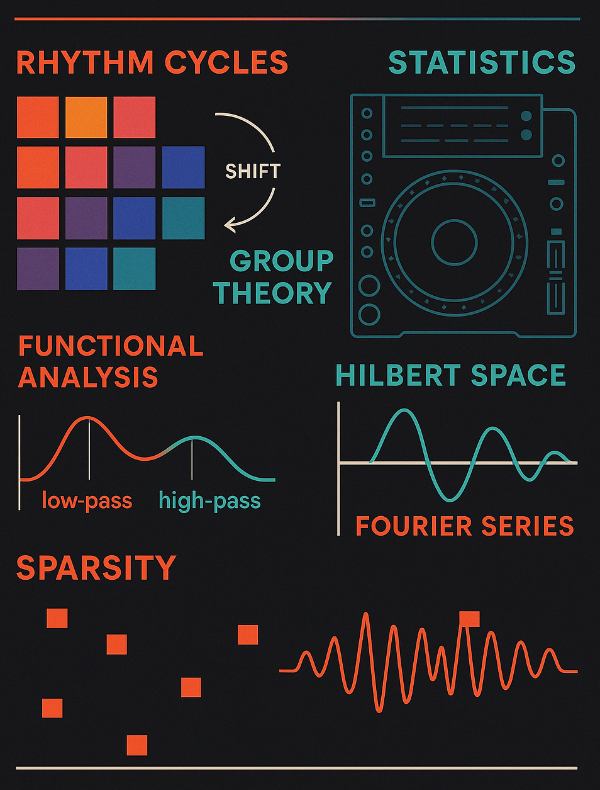

# Las Matemáticas de la Música Electrónica

📍 **Fundación Telefónica**, Madrid  
📅 **26 de septiembre de 2025**  
🎙️ **Carlos García Meixide (ICMAT-CSIC)**  

Este repositorio contiene el material de la charla divulgativa **"Las matemáticas de la música electrónica"**, un evento interactivo que exploró la conexión entre las matemáticas y la música techno.

La sesión combinó demostraciones sonoras, visualizaciones y ejemplos de síntesis aditiva en tiempo real, mostrando cómo la teoría de Fourier permite **reconstruir formas de onda compleja** a partir de armónicos.

---

## 🧩 Ejecución del script

Para reproducir la demostración, ejecuta en tu terminal:

```bash
python fourier_stems.py --waveform triangle --f0 110 --duration 6 --sr 48000
```

### 🔍 Explicación de los argumentos

| Argumento | Descripción |
|------------|-------------|
| `--waveform triangle` | Especifica la forma de onda objetivo a reconstruir. Puede ser `triangle`, `square` o `saw`. |
| `--f0 110` | Frecuencia fundamental (Hz). En este caso, **110 Hz** corresponde al **La₂ (A2)**. |
| `--duration 6` | Duración total del audio generado (en segundos). |
| `--sr 48000` | Frecuencia de muestreo (samples por segundo). Un estándar en audio digital profesional. |

El script genera varios ficheros `.wav` correspondientes a los primeros armónicos, así como una mezcla parcial que se aproxima a la onda **triangular**.  

Puedes importar estos stems en **Traktor**, **Ableton** o cualquier DAW para escuchar cómo la suma de armónicos reconstruye la señal original.

---

## 🎨 Cartel del evento



---

## 📚 Créditos

- **Autor:** Carlos García Meixide  
- **Institución:** Instituto de Ciencias Matemáticas (ICMAT-CSIC)  
- **e-mail:** carlos.garcia@icmat.es


